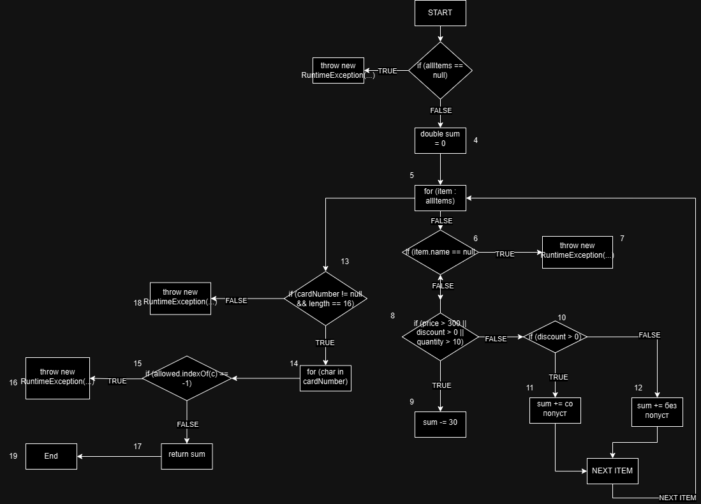

Име: Андреј 
Презиме: Петрушевски  
Индекс: 161220  

2. CFG

3. ## Цикломатска комплексност

Цикломатската комплексност (McCabe Complexity) се пресметува со формулата:

M = број на предикати + 1

Во функцијата `checkCart`, ги имаме следниве предикати:

1. `if (allItems == null)`
2. `for (item : allItems)`
3. `if (item.getName() == null || item.getName().length() == 0)`
4. `if (item.getPrice() > 300 || item.getDiscount() > 0 || item.getQuantity() > 10)`
5. `if (item.getDiscount() > 0)`
6. `if (cardNumber != null && cardNumber.length() == 16)`
7. `for (char c : cardNumber)`
8. `if (allowed.indexOf(c) == -1)`

Вкупно: 8 услови  
Значи: M = 8 + 1 = 9

Цикломатската комплексност на функцијата `checkCart` е 9, што значи дека има 9 независни патеки низ кодот.

4. ## Statement Coverage

Креирани се 4 тест случаи за да се покријат сите извршливи линии од функцијата `checkCart`.

Тест 1 - `allItems == null` → throw exception 
Тест 2 - item со `null` име → throw exception 
Тест 3 - валиден item без попуст → нормална пресметка 
Тест 4 - item што активира -30 услов и има попуст 

Сите statements се покриени барем еднаш со овие случаи. Затоа, минималниот број на тест случаи за Statement Coverage е 4.

5. ## Multiple Condition Coverage

### Услов:
if (item.getPrice() > 300 || item.getDiscount() > 0 || item.getQuantity() > 10)
Содржи 3 подуслови:

A: item.getPrice() > 300

B: item.getDiscount() > 0

C: item.getQuantity() > 10

Според Multiple Condition критериумот, потребно е да се проверат сите можни комбинации на TRUE/FALSE за овие подуслови, односно 2³ = 8 комбинации.

Тест случаи:

- Тест 1: A = false, B = false, C = false → условот е false → не се активира 
- Тест 2: A = true, B = false, C = false → условот е true → се активира 
- Тест 3: A = false, B = true, C = false → условот е true → се активира 
- Тест 4: A = false, B = false, C = true → условот е true → се активира
- Тест 5: A = true, B = true, C = false → условот е true → се активира
- Тест 6: A = true, B = false, C = true → условот е true → се активира 
- Тест 7: A = false, B = true, C = true → условот е true → се активира
- Тест 8: A = true, B = true, C = true → условот е true → се активира 

Објаснување:
Со овие 8 тест случаи се проверуваат сите можни комбинации на вистинитосни вредности на подусловите A, B и C.
Ова гарантира целосна Multiple Condition покриеност за наведениот услов.

Минимален број на тест случаи
Иако целосната покриеност бара 8 комбинации, според дефиницијата на Multiple Condition критериумот, минимално се потребни 5 тест случаи, ако се изберат така што:

секој подуслов (A, B, C) има вредности и true и false

целиот услов (A || B || C) се евалуира и како true и како false

Пример за минимален сет:

Тест 1: false, false, false → false

Тест 2: true, false, false → true

Тест 3: false, true, false → true

Тест 4: false, false, true → true

Тест 5: true, true, true → true

